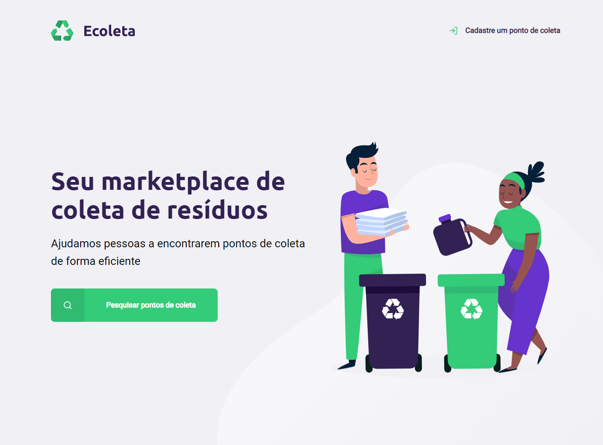

## Nex Level Week: Aplicação web do zero - Rocketseat

**Desafios:**

1. Criar uma aplicação web com informações de pontos de coleta da sua cidade

**Layout da aplicação:**

<h1 align="center">
    
</h1>

### :computer: Tecnologias

- [JavaScript](https://www.javascript.com)
- [HTML](https://www.w3.org)
- [CSS](https://www.w3.org/Style/CSS/Overview.en.html)

Por: Lucas Victor 